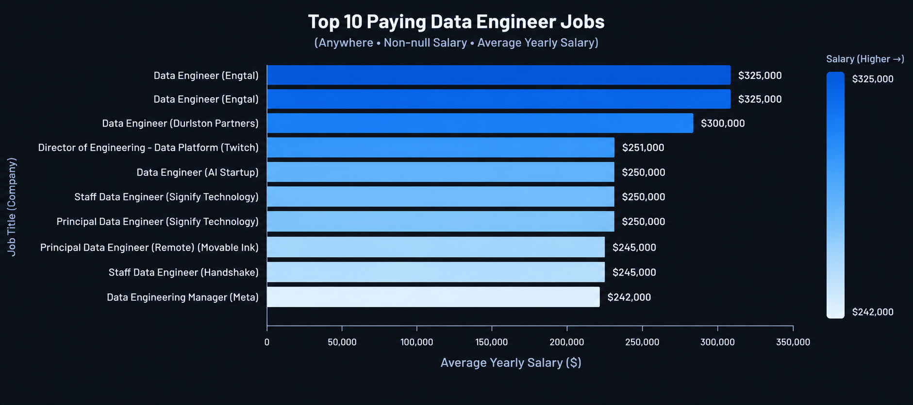

# Introduction
Dive into the data job market!! Focus on data engineering roles, this project explores top-paying jobs, in-demand skills, and where high demand meets high salary.

SQL queries? Check them out here: [Queries folder](/DataNerdProject/Queries/)

# Background
Driven by a quest to navigate the data engineering job market more effectively, this project was born from a desire to pinpoint top-paid and in-demand skills, streamlining others work to find optimal jobs.

This project is packed with insights on job titles, salaries, locations and essential skills.

### The questions I wanted to answer through my SQL queries were:

1. What are the top-paying data engineer jobs?
2. What skills are required for these top-paying jobs?
3. What skills are most in demand for data engineers?
4. Which skills are associated with higher salaries?
5. What are the most optimal skills to learn?

# Tools I Used

For my deep dive into the data engineer job market, I harnessed the power of several key tools:

- **SQL**: The backbone of my analysis, allowing me to query the database and unearth critical insights.

- **PostgreSQL**: The chosen database management system, ideal for handling the job posting data.

- **Visual Studio Code**: My go-to for database management and executing SQL queries.

- **Git & GitHub**: Essential for version control and sharing my SQL scripts and analysis, ensuring collaboration and project tracking.

# The Analysis
Each query for this project aimed at investigating specific aspects of the data engineer job market. Here's how I approached each question:

### 1. Top Paying Data Engineer Jobs

To identify the highest-paying roles, I filtered data engineer positions by average yearly salary and location, focusing on remote jobs. This query highlights the high paying opportunities in the field.

``` sql
SELECT 
    j.job_id, 
    j.job_title_short, 
    j.salary_year_avg,
    j.job_location,
    c.name AS company_name,
    j.job_title, 
    j.job_schedule_type

FROM job_postings_fact AS j
LEFT JOIN company_dim AS c
ON j.company_id = c.company_id

WHERE
    j.job_title_short = 'Data Engineer'
    AND
    j.salary_year_avg IS NOT NULL
    AND
    j.job_location = 'Anywhere'

ORDER BY j.salary_year_avg DESC

LIMIT 10;
```

Here's the breakdown of the top data engineer jobs in 2023:  

- **Wide Salary Range**: Top 10 paying data engineer roles span from $242,000 to $325,000, indicating significant salary potential in the field.  

- **Diverse Employers**: Companies like Engtal, Meta, and Twitch are among those offering high salaries, showing a broad interest across different industries.  

- **Job Title Variety**: There's a high diversity in job titles, from Data Engineer to Director of Engineering - Data Platform, reflecting varied roles and specializations within data engineering.


*Bar graph visualizing the salary for the top 10 salaries for data engineers; ChatGPT generated this graph from my SQL query results*

# What I learned

Throughout this adventure, I've turbocharged my SQL toolkit with some serious firepower:

- **🧩 Complex Query Crafting**: Mastered the art of advanced SQL, merging tables like a pro and wielding WITH clauses for ninja-level temp table maneuvers.  

- **📊 Data Aggregation**: Got cozy with GROUP BY and turned aggregate functions like COUNT() and AVG() into my data-summarizing sidekicks.

- **💡 Analytical Wizardry**: Leveled up my real-world puzzle-solving skills, turning questions into actionable, insightful SQL queries.

# Conclusions


### Insights  
From the analysis, several general insights emerged:  

1. **Top-Paying Data engineer Jobs**: The highest-paying jobs for data engineers that allow remote work offer a wide range of salaries, the highest at $325,000!  

2. **Skills for Top-Paying Jobs**: High-paying data engineer jobs require advanced proficiency in SQL, suggesting it's a critical skill for earning a top salary.

3. **Most In-Demand Skills**: SQL is also the most demanded skill in the data engineer job market, thus making it essential for job seekers.

4. **Skills with Higher Salaries**: Specialized skills, such as SVN and Solidity, are associated with the highest average salaries, indicating a premium on niche expertise.

5. **Optimal Skills for Job Market Value**: SQL leads in demand and offers for a high average salary, positioning it as one of the most optimal skills for data engineers to learn to maximize their market value.

### Closing Thoughts

This project enhanced my SQL skills and provided valuable insights into the data engineer job market. The findings from the analysis serve as a guide to prioritizing skill development and job search efforts. Aspiring data engineers can better position themselves in a competitive job market by focusing on high-demand, high-salary skills. This exploration highlights the importance of continuous learning and adaptation to emerging trends in the field of data engineering.