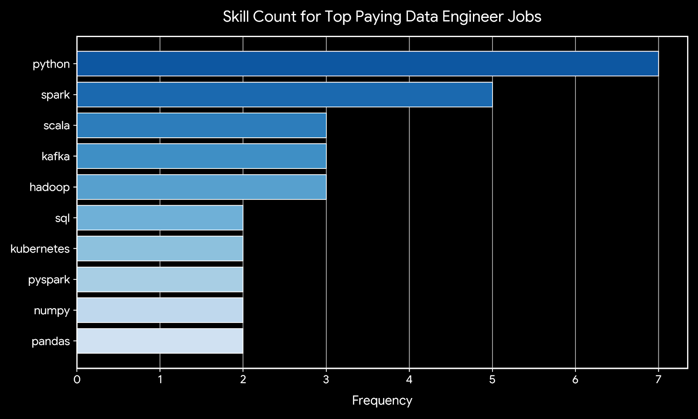

# Introduction
Dive into the data job market!! Focus on data engineering roles, this project explores top-paying jobs, in-demand skills, and where high demand meets high salary.

SQL queries? Check them out here: [Queries folder](/DataNerdProject/Queries/)

# Background
Driven by a quest to navigate the data engineering job market more effectively, this project was born from a desire to pinpoint top-paid and in-demand skills, streamlining others work to find optimal jobs.

This project is packed with insights on job titles, salaries, locations and essential skills.

### The questions I wanted to answer through my SQL queries were:

1. What are the top-paying data engineer jobs?
2. What skills are required for these top-paying jobs?
3. What skills are most in demand for data engineers?
4. Which skills are associated with higher salaries?
5. What are the most optimal skills to learn?

# Tools I Used

For my deep dive into the data engineer job market, I harnessed the power of several key tools:

- **SQL**: The backbone of my analysis, allowing me to query the database and unearth critical insights.

- **PostgreSQL**: The chosen database management system, ideal for handling the job posting data.

- **Visual Studio Code**: My go-to for database management and executing SQL queries.

- **Git & GitHub**: Essential for version control and sharing my SQL scripts and analysis, ensuring collaboration and project tracking.

# The Analysis
Each query for this project aimed at investigating specific aspects of the data engineer job market. Here's how I approached each question:

### 1. Top Paying Data Engineer Jobs

To identify the highest-paying roles, I filtered data engineer positions by average yearly salary and location, focusing on remote jobs. This query highlights the high paying opportunities in the field.

``` sql
SELECT 
    j.job_id, 
    j.job_title_short, 
    j.salary_year_avg,
    j.job_location,
    c.name AS company_name,
    j.job_title, 
    j.job_schedule_type

FROM job_postings_fact AS j
LEFT JOIN company_dim AS c
ON j.company_id = c.company_id

WHERE
    j.job_title_short = 'Data Engineer'
    AND
    j.salary_year_avg IS NOT NULL
    AND
    j.job_location = 'Anywhere'

ORDER BY j.salary_year_avg DESC

LIMIT 10;
```

Here's the breakdown of the top data engineer jobs in 2023:  

- **Wide Salary Range**: Top 10 paying data engineer roles span from $242,000 to $325,000, indicating significant salary potential in the field.  

- **Diverse Employers**: Companies like Engtal, Meta, and Twitch are among those offering high salaries, showing a broad interest across different industries.  

- **Job Title Variety**: There's a high diversity in job titles, from Data Engineer to Director of Engineering - Data Platform, reflecting varied roles and specializations within data engineering.


*Bar graph visualizing the salary for the top 10 salaries for data engineers; ChatGPT generated this graph from my SQL query results*

### 2. Skills for Top Paying Jobs

To understand what skills are required for the top-paying jobs, I joined the job postings with the skills data, providing insights into what employers value for high-compensation roles.

``` sql
WITH top_jobs AS (
    SELECT 
        j.job_id, 
        j.job_title_short, 
        j.salary_year_avg,
        c.name AS company_name

    FROM job_postings_fact AS j
    LEFT JOIN company_dim AS c
    ON j.company_id = c.company_id

    WHERE
        j.job_title_short = 'Data Engineer'
        AND
        j.salary_year_avg IS NOT NULL
        AND
        j.job_location = 'Anywhere'

    ORDER BY j.salary_year_avg DESC

    LIMIT 10
)

SELECT 
    top_jobs.*,
    sd.skills 
FROM top_jobs
INNER JOIN skills_job_dim AS s ON top_jobs.job_id = s.job_id
INNER JOIN skills_dim AS sd ON s.skill_id = sd.skill_id
ORDER BY top_jobs.salary_year_avg DESC;
```

Here's the breakdown of the most demanded skills for the top 10 highest paying data analyst jobs in 2023:

- **Python** is leading with a bold count of 7.

- **Spark** follows closely with a bold count of 5.

- **Tableau, Kafka and Scala** are also highly sought after, with a bold count of 3 each

Other skills like sql, databricks, pandas, numpy, pyspark, kubernetes show varying degrees of demand.


*Bar graph visualizing the count of skills for the top 10 paying jobs for data engineers; Gemini generated this graph from my SQL query results*

### 3. In-Demand Skills for Data Engineers

This query helped identify the skills most frequently requested in job postings, directing focus to areas with high demand.

``` sql
SELECT 
    s.skills,
    COUNT(sj.job_id) AS in_demand_count

FROM job_postings_fact j

LEFT JOIN skills_job_dim AS sj 
ON j.job_id = sj.job_id

LEFT JOIN skills_dim AS s 
ON sj.skill_id = s.skill_id

WHERE 
    j.job_title_short = 'Data Engineer' 
    AND j.job_location LIKE 'India'

GROUP BY 
    s.skills

ORDER BY 
    in_demand_count DESC

LIMIT 5;
```

| Skills | Demand Count |
| :--- | :--- |
| SQL | 1155 |
| Python | 1073 |
| Spark | 671 |
| AWS | 643 |
| Azure | 608 |

Table of the demand for the top 5 skills in data engineer job postings

### 4. Skills Based on Salary

Exploring the average salaries associated with different skills revealed which skills are the highest paying.

``` sql
SELECT 
    skills,
    ROUND(AVG(j.salary_year_avg), 0) AS salary_avg

FROM job_postings_fact j 

INNER JOIN skills_job_dim s ON j.job_id = s.job_id
INNER JOIN skills_dim sd ON s.skill_id = sd.skill_id

WHERE j.job_title_short = 'Data Engineer'
AND j.salary_year_avg IS NOT NULL
-- AND j.job_work_from_home = TRUE

GROUP BY skills

ORDER BY salary_avg DESC

LIMIT 10;
```
Here's a breakdown of the results for top paying skills for data engineer:

- High Demand for Full-Stack & Web Application Frameworks: The top spot is claimed by Node ($181,862), alongside Vue ($159,375), highlighting that data professionals who possess full-stack software development skills to build web applications, endpoints, and data delivery platforms command a massive salary premium.

- Scalable NoSQL & Big Data Infrastructure: Mongo ($179,403) and Cassandra ($150,255) represent two of the highest-earning skills, emphasizing that companies heavily reward engineers skilled in architecting, querying, and managing high-throughput, non-relational database systems.

- Specialized Visualization, Blockchain & Low-Level Languages: ggplot2 ($176,250) leads in visualization capability, while niche tools and languages like Solidity ($166,250 for smart contract/blockchain logic), CodeCommit ($155,000 for version control/deployment), Ubuntu ($154,455 for Linux OS mastery), Clojure ($153,663 for functional programming), and Rust ($147,771 for high-performance memory safety) reflect a heavy market premium on specialized systems engineering and advanced analytics.


| Skills | Average Salary ($) |
| --- | --- |
| Node | $181,862 |
| Mongo | $179,403 |
| ggplot2 | $176,250 |
| Solidity | $166,250 |
| Vue | $159,375 |
| CodeCommit | $155,000 |
| Ubuntu | $154,455 |
| Clojure | $153,663 |
| Cassandra | $150,255 |
| Rust | $147,771 |

Table of the average salary for the top 10 paying skills for data engineers

### 5. Most Optimal Skilles to Learn

Combining insights from demand and salary data, this query aimed to pinpoint skills that are both in high demand and have high salaries, offering a strategic focus for skill development.

``` sql
WITH Skill_demand AS (
    SELECT 
        sj.skill_id,
        sd.skills,
        COUNT(sj.job_id) AS in_demand_count

    FROM job_postings_fact j

    INNER JOIN skills_job_dim sj
        ON j.job_id = sj.job_id

    INNER JOIN skills_dim sd
        ON sj.skill_id = sd.skill_id

    WHERE j.job_title_short = 'Data Engineer'
      AND j.job_location LIKE 'India'
      AND j.salary_year_avg IS NOT NULL

    GROUP BY 
        sj.skill_id,
        sd.skills
),

average_salary AS (
    SELECT 
        sj.skill_id,
        sd.skills,
        ROUND(AVG(j.salary_year_avg), 0) AS salary_avg

    FROM job_postings_fact j

    INNER JOIN skills_job_dim sj
        ON j.job_id = sj.job_id

    INNER JOIN skills_dim sd
        ON sj.skill_id = sd.skill_id

    WHERE j.job_title_short = 'Data Engineer'
      AND j.salary_year_avg IS NOT NULL
      AND j.job_work_from_home = TRUE

    GROUP BY 
        sj.skill_id,
        sd.skills
)

SELECT 
    skill_demand.skill_id,
    skill_demand.skills,
    skill_demand.in_demand_count,
    average_salary.salary_avg

FROM skill_demand

INNER JOIN average_salary
    ON skill_demand.skill_id = average_salary.skill_id

-- WHERE in_demand_count > 10
ORDER BY in_demand_count DESC, 
         salary_avg DESC

LIMIT 10;
```


| Skill ID | Skills | Demand Count | Average Salary ($) |
| :--- | :--- | :--- | :--- |
| 213 | Kubernetes | 3 | $158,190 |
| 98 | Kafka | 5 | $150,549 |
| 93 | Pandas | 4 | $144,656 |
| 3 | Scala | 4 | $141,777 |
| 92 | Spark | 9 | $139,838 |
| 62 | MongoDB | 5 | $138,569 |
| 96 | Airflow | 3 | $138,518 |
| 4 | Java | 6 | $138,087 |
| 97 | Hadoop | 5 | $137,707 |
| 2 | NoSQL | 9 | $136,430 |

Table of the most optimal skills for data analyst sorted by salary

Here's a breakdown of the most optimal skills based on demand and average salary:

- High-Demand Core Technologies: SQL and Python lead overall demand with 23 and 16 job counts, respectively. While widely required across data roles, they maintain strong earning potential with average salaries around $129,191 for SQL and $132,200 for Python, reflecting their status as essential foundational tools.

- Cloud Platforms & Big Data Ecosystems: Cloud infrastructure tools (Azure, AWS) and big data processing frameworks (Spark, Databricks) show substantial demand (ranging from 9 to 14 counts) alongside premium average salaries up to $139,838 for Spark, highlighting the high compensation tied to enterprise cloud architecture and distributed data processing.

- Database & Object-Oriented Engineering: Proficiency in non-relational storage (NoSQL) and traditional programming (Java) commands high average salaries ($136,430 and $138,087 respectively), indicating a strong market preference for data engineering, system integration, and flexible database management capabilities.

- Business Intelligence & Data Visualization: Core BI tools like Tableau (8 count, $115,246 avg) and Power BI (7 count, $116,949 avg) remain top-tier requirements for reporting, demonstrating consistent demand for turning raw data into visual executive insights.


# What I learned

Throughout this adventure, I've turbocharged my SQL toolkit with some serious firepower:

- **🧩 Complex Query Crafting**: Mastered the art of advanced SQL, merging tables like a pro and wielding WITH clauses for ninja-level temp table maneuvers.  

- **📊 Data Aggregation**: Got cozy with GROUP BY and turned aggregate functions like COUNT() and AVG() into my data-summarizing sidekicks.

- **💡 Analytical Wizardry**: Leveled up my real-world puzzle-solving skills, turning questions into actionable, insightful SQL queries.

# Conclusions


### Insights  
From the analysis, several general insights emerged:  

1. **Top-Paying Data engineer Jobs**: The highest-paying jobs for data engineers that allow remote work offer a wide range of salaries, the highest at $325,000!  

2. **Skills for Top-Paying Jobs**: High-paying data engineer jobs require advanced proficiency in SQL, suggesting it's a critical skill for earning a top salary.

3. **Most In-Demand Skills**: SQL is also the most demanded skill in the data engineer job market, thus making it essential for job seekers.

4. **Skills with Higher Salaries**: Specialized skills, such as SVN and Solidity, are associated with the highest average salaries, indicating a premium on niche expertise.

5. **Optimal Skills for Job Market Value**: SQL leads in demand and offers for a high average salary, positioning it as one of the most optimal skills for data engineers to learn to maximize their market value.

### Closing Thoughts

This project enhanced my SQL skills and provided valuable insights into the data engineer job market. The findings from the analysis serve as a guide to prioritizing skill development and job search efforts. Aspiring data engineers can better position themselves in a competitive job market by focusing on high-demand, high-salary skills. This exploration highlights the importance of continuous learning and adaptation to emerging trends in the field of data engineering.